# 充电桩运营与故障工单管理平台

项目仓库：[ifox-hu/YUNENG-ChargeOS](https://github.com/ifox-hu/YUNENG-ChargeOS)。

在线演示：[驭能智充运营后台](https://ifox-hu.github.io/YUNENG-ChargeOS/)。演示账号：`demo`，密码：`Demo123456!`。演示使用浏览器模拟接口，不连接后端。

当前公开仓库包含统一说明、三个源码模块、静态演示产物及发布脚本。源码模块在本地仍保留独立 Git 历史，公开仓库中提供可直接浏览和修改的源文件。

基于慧知开源充电平台二次开发的全栈演示项目，覆盖 Java 微服务、Vue 2 运营后台和 uni-app Vue 3 微信小程序。项目重点展示“设备告警/用户报修 → 工单处理 → 用户确认 → 运营统计”的闭环，并补充余额、积分、模拟充电和订单查询能力。

> 本项目用于本地开发、实习项目展示和功能演示。微信支付、短信、真实充电桩协议、生产域名和正式小程序发布仍需独立配置与验收。

## 功能

- **运营后台**：站点、充电桩、端口、计费规则、订单、用户和故障工单管理。
- **故障工单闭环**：模拟设备告警、用户扫码/手动报修、工单分配、处理日志、解决结果、用户确认关闭、近七天统计。
- **小程序充电**：站点浏览、端口选择、模拟开始/结束充电、实时状态、订单和个人中心。
- **账户能力**：余额摘要、余额流水、本地模拟充值；每日签到、订单奖励积分、积分明细和重复操作保护。
- **可靠性设计**：登录会话身份校验、租户隔离、事务状态流转、同设备同类活动工单合并、充值和积分业务幂等。

## 项目结构

```text
huizhi/
├─ huizhi-cloud/        Spring Cloud 后端与 Docker 编排
├─ huizhi-admin/        Vue 2 + Element UI 运营管理后台
├─ huizhi-mini/         uni-app Vue 3 微信小程序
├─ site/                GitHub Pages 静态演示页
└─ README.md            项目统一说明
```

## 技术栈

| 模块 | 技术 |
| --- | --- |
| 后端 | Java 8 运行时、Spring Boot、Spring Cloud、Nacos、MyBatis-Plus、JdbcTemplate、MySQL 8、Redis |
| 管理后台 | Vue 2、Vue CLI、Element UI、Axios、ECharts |
| 小程序 | uni-app、Vue 3、Vant Weapp、微信开发者工具 |
| 本地运行 | Docker Desktop、Docker Compose、Windows PowerShell |

## 环境要求

- Windows 10/11、Docker Desktop（Linux 容器，数据盘可放在 D 盘）
- JDK 17 和 Maven 3.9 用于本地构建；容器内服务使用 Java 8 JRE
- Node.js、npm、HBuilderX 5.26、微信开发者工具
- Git

## 快速启动

以下命令分别从仓库根目录执行。Windows 先启动 Docker Desktop，再运行后端服务；Linux 虚拟机部署见下一节。

```powershell
Set-Location .\huizhi-cloud\docker
powershell -ExecutionPolicy Bypass -File .\start-local.ps1 -AllModules
```

常用地址：

| 服务 | 地址 |
| --- | --- |
| 运营后台 | http://127.0.0.1:8001 |
| 网关 | http://127.0.0.1:38080 |
| 小程序 API | http://127.0.0.1:38080/hcp-mp/ |
| Nacos | http://127.0.0.1:8848/nacos |
| MySQL | 127.0.0.1:3307 |

### Linux 虚拟机部署（Ubuntu 22.04/24.04，x86_64）

建议分配 4 核 CPU、10 GB 内存、40 GB 可用磁盘。桥接网络可直接从宿主机访问虚拟机；NAT 网络需配置端口转发。Linux 内安装 Docker Engine，无需 Docker Desktop。

#### 1. 安装环境

参考 [Docker 官方 Ubuntu 安装说明](https://docs.docker.com/engine/install/ubuntu/)安装 Docker Engine 和 Compose 插件，确认 `docker compose version` 可用。安装构建工具：

```bash
sudo apt update
sudo apt install -y git curl openjdk-17-jdk maven nodejs npm
sudo systemctl enable --now docker
sudo usermod -aG docker "$USER"
# 注销并重新登录终端后继续，或在后续 Docker 命令前加 sudo。
java -version
mvn -version
node -v
docker compose version
```

Node.js 建议使用 18 或 20；Ubuntu 22.04 仓库可能提供较旧版本，需另行安装相应版本。现有后台是 Vue 2 / Vue CLI，编译时使用 `NODE_OPTIONS=--openssl-legacy-provider`。JDK 17 用于编译，业务容器使用仓库 Dockerfile 中的 Java 8 JRE。

#### 2. 克隆并编译

```bash
git clone https://github.com/ifox-hu/YUNENG-ChargeOS.git
cd YUNENG-ChargeOS
bash huizhi-cloud/docker/prepare-linux.sh
```

脚本编译后端，将各模块 JAR 复制到对应 Docker 构建目录，再编译 `huizhi-admin` 并复制到 Nginx 静态目录。需要访问 Maven、npm 和 Docker 镜像仓库；源码中不包含预编译 JAR。

#### 3. 首次启动

```bash
# 在仓库根目录执行；VM_IP 替换为虚拟机实际 IPv4，例如 192.168.1.100。
export NETWORK_IP=192.168.1.100
export LOCAL_FILE_DOMAIN="http://${NETWORK_IP}:8001/prod-api/file"
bash huizhi-cloud/docker/start-linux.sh
```

脚本按顺序启动 MySQL、Redis、Nacos，等待健康检查，执行账户登录、故障工单、余额积分及 Nacos 兼容增量 SQL，发布容器内部数据库/Redis 地址，最后构建并启动业务模块（含 `extras` 和 `simulator`）。初次 MySQL 数据目录为空时，镜像会导入 `docker/mysql/db` 下的基础 SQL；已有数据库不会重复导入，勿删除数据目录或使用 `down -v` 来“重试”。

```bash
cd huizhi-cloud/docker
docker compose ps
docker compose logs --tail=100 hcp-gateway hcp-mp hcp-operator
curl http://localhost:8001/prod-api/code
```

网关就绪后，最后一个请求应返回 `code: 200`。首次 Java 服务启动可能需要数分钟。宿主机访问 `http://虚拟机IP:8001`；Nacos 为 `http://虚拟机IP:8848/nacos`。虚拟机防火墙若已启用，按需允许宿主机访问 8001（后台）、38080（小程序 API）、39206（充电 WebSocket）；8848 仅用于管理。`hcp-*` 容器通过 Docker 网络互相通信。

#### 4. 小程序连接虚拟机

小程序仍在 Windows/macOS 的 HBuilderX 和微信开发者工具中编译、测试。修改 `huizhi-mini/App.vue` 的 `serverUrl` 为 `http://虚拟机IP:38080/hcp-mp/`、`wsurl` 为 `ws://虚拟机IP:39206/websocket/charge/`，使用自己的开发 AppID，重新编译后导入 `unpackage/dist/dev/mp-weixin`。开发者工具本地调试可勾选“不校验合法域名”；真机和正式发布需单独配置 HTTPS/WSS、证书及微信服务器域名。

#### 5. 停止、更新与排错

```bash
# 在 huizhi-cloud/docker 下
docker compose stop                   # 停止服务，保留数据库
docker compose up -d                 # 再次启动核心服务
docker compose --profile extras --profile simulator up -d  # 启动全部模块
# 更新源码后，从仓库根目录重新执行 prepare-linux.sh 和 start-linux.sh。
```

常见问题：镜像或 Maven/npm 下载失败时检查虚拟机联网；端口冲突时检查 Compose 的 ports；后台 502 时检查 Nacos 健康状态和网关日志；数据库连接失败时检查 Nacos `hcp` 命名空间中的 datasource 是否指向 `hcp-mysql:3306/vctgo_platform`。现有开发数据、默认密码、模拟登录/充值开关仅用于本地演示，生产部署应更换凭据并关闭模拟入口。

本方案按当前仓库脚本与 [慧知项目结构](https://doc.huizhidata.com/hcp-cloud/project-structure.html)、[上游 Docker 部署说明](https://doc.huizhidata.com/hcp-cloud/deploy/docker-deploy.html)整理；当前未在全新 Linux 虚拟机上执行完整部署，Linux 脚本语法与 Compose 配置检查结果见本次验证说明。

本地演示账号：后台 `admin / admin123`；小程序 `demo / Demo123456!`。这些账号只适用于本地演示，不能直接用于公网环境。

## 小程序界面预览

以下截图来自仓库中的 **uni-app H5 构建产物**，使用本地演示账号连接本机开发接口生成，用于展示实际页面和已有测试数据；它们不是微信开发者工具模拟器截图。Vant Weapp 是微信专用组件，H5 预览中的按钮、排序栏、端口布局和弹窗与微信端存在显示差异，截图不作为微信端完整交互验收结果。

### 首页与站点服务

首页提供附近站点、距离/价格/智能排序、快慢充空闲数量、费用与停车信息；点击站点后查看设备，再进入端口、时长和计费标准选择页。底部提供首页、扫码充电、我的入口。

| 首页 · 距离最近 | 首页 · 价格最低 | 首页 · 智能排序 |
| --- | --- | --- |
| 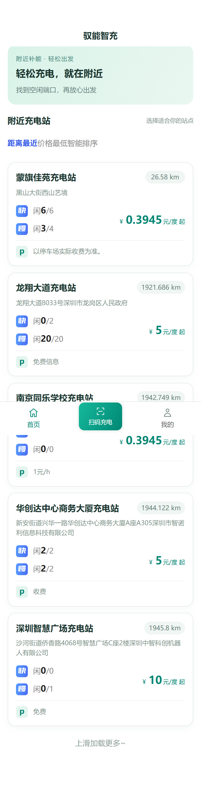 | 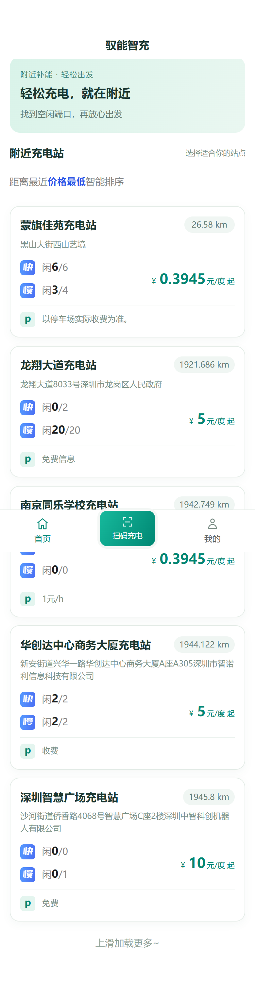 | 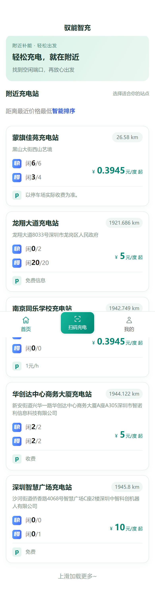 |

| 站点设备与空闲状态 | 端口、充电时长与计费标准 |
| --- | --- |
| 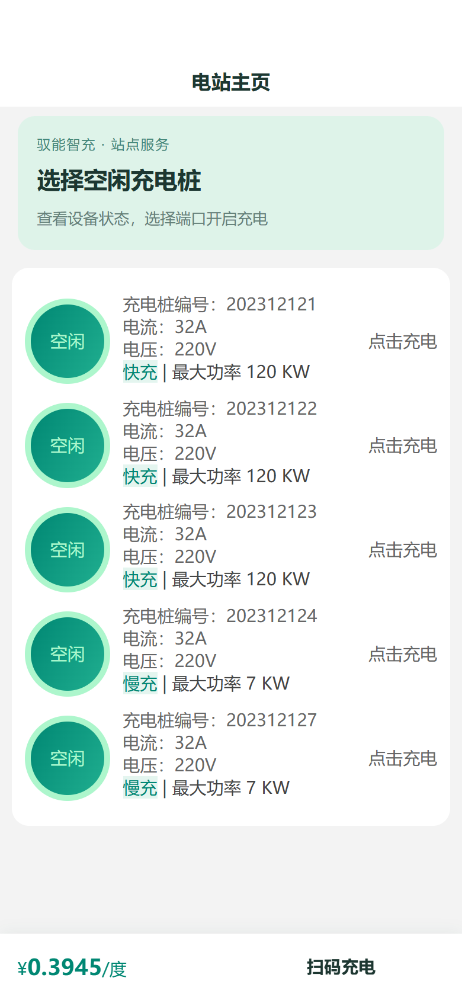 | 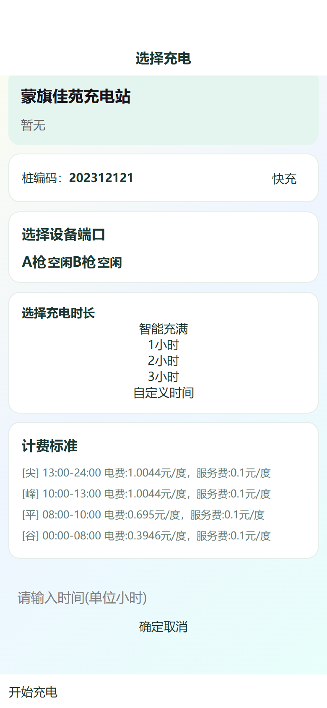 |

扫码充电调用微信扫码能力，识别充电桩编码后进入上述选择页；H5 截图使用接口返回的现有桩编码打开页面，未模拟微信摄像头扫码。正在充电页面的实时 WebSocket、倒计时和结束充电流程需在微信端单独验证。

### 充电订单与费用详情

订单列表提供全部、进行中、已完成筛选；已完成订单可查看设备信息、充电时长、订单号、电费、服务费、支付金额和状态日志。以下为已有本地测试订单，不代表真实付款凭证。当前旧测试记录的结束时间为空、金额含长小数，截图保留接口返回值，未修改订单数据。

| 我的充电订单 | 已完成订单详情与状态日志 |
| --- | --- |
| 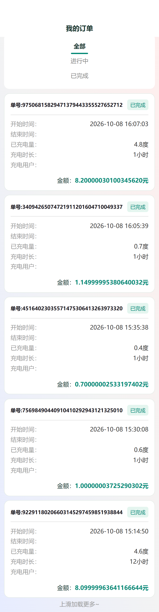 | 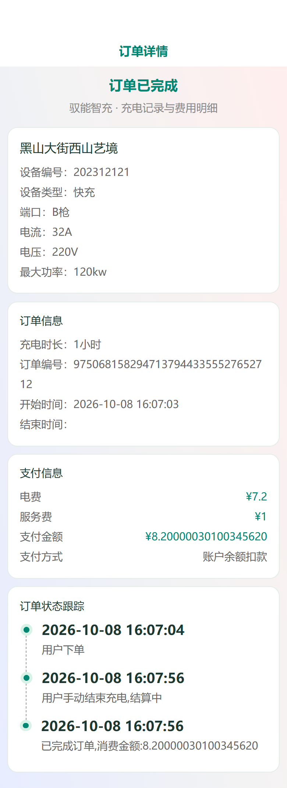 |

### 账户与报修

| 我的 | 余额 | 积分 |
| --- | --- | --- |
| 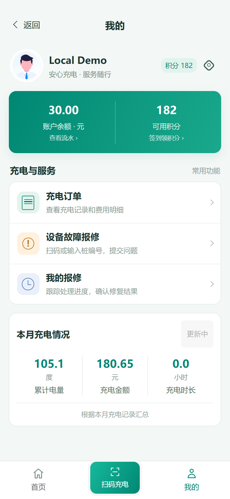 | 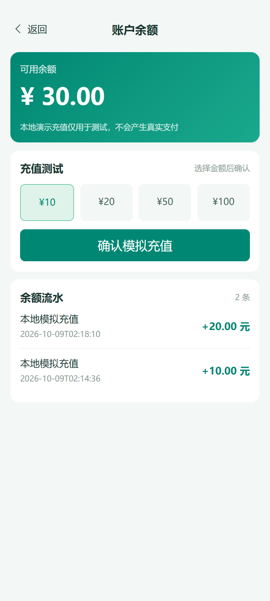 | 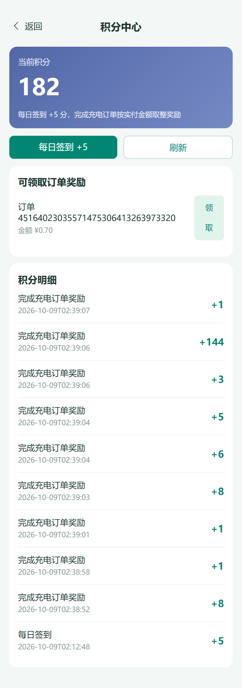 |

| 账号登录 | 创建设备报修 | 我的报修 |
| --- | --- | --- |
| 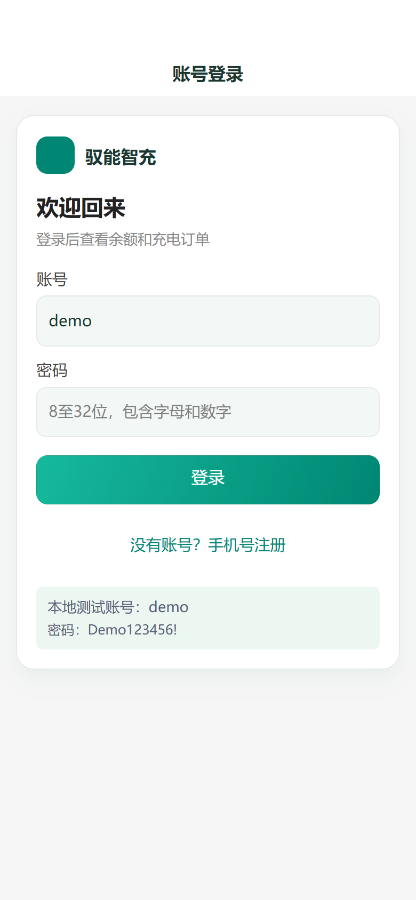 | 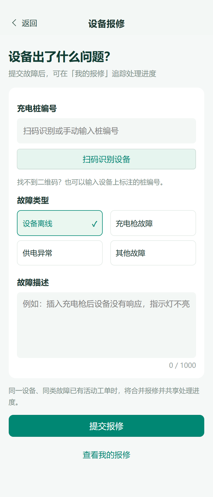 | 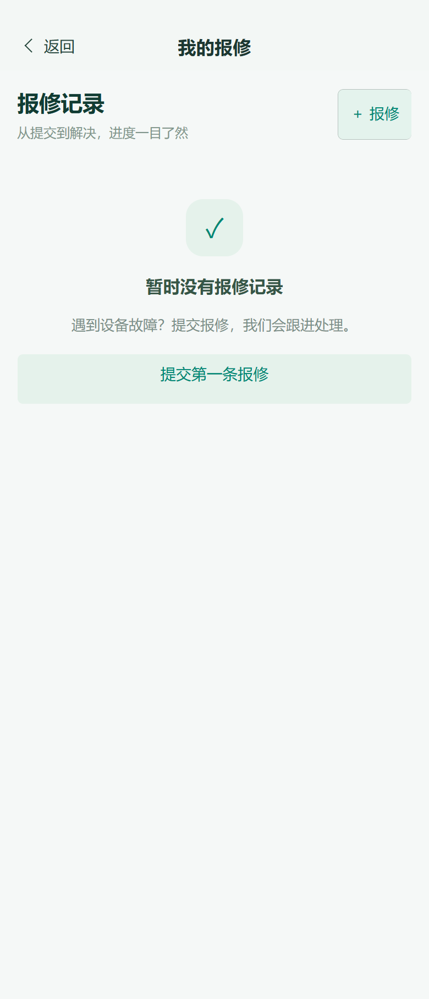 |

重新生成截图：先启动本地 API，在 HBuilderX 中将小程序运行到浏览器生成 H5 产物，并将产物目录用静态服务器提供在 `http://127.0.0.1:8421/`。安装 Playwright，确保本机有 Edge；若 Playwright 不在当前依赖目录，可用 `PLAYWRIGHT_MODULE` 指定模块位置。

```powershell
node .\scripts\capture-mini-h5.cjs
```

脚本不会创建真实支付、充电或工单，只读取演示账号已有数据。

## 编译与部署

### 后端

```powershell
Set-Location .\huizhi-cloud
mvn -pl hcp-modules/hcp-mp -am package -DskipTests
Copy-Item hcp-modules\hcp-mp\target\hcp-mp.jar docker\hcp\modules\mp\jar\hcp-mp.jar -Force
Set-Location docker
docker compose build hcp-mp
docker compose up -d hcp-mp
```

数据库增量脚本位于 `huizhi-cloud/docker/`，包括故障工单和余额积分表。公开仓库前请检查 SQL、Nacos 配置和日志中是否含有真实密码或令牌。

### 管理后台

```powershell
Set-Location .\huizhi-admin
npm ci
npm run build:prod
```

构建后的 `dist` 可复制到后端 Docker 的 Nginx 静态目录，然后重启 `hcp-nginx`。

### 微信小程序

```powershell
Set-Location .\huizhi-mini
npm ci
powershell -ExecutionPolicy Bypass -File .\scripts\compile-local.ps1
```

在微信开发者工具导入：

```text
huizhi-mini\unpackage\dist\dev\mp-weixin
```

如果页面出现旧内容或事件跳转错乱，先使用“工具 → 清除缓存 → 清除文件缓存”，再重新编译。

## 主要接口

小程序接口统一使用 `token: Bearer <token>` 请求头：

```text
POST /hcp-mp/v1/auth/account/login
GET  /hcp-mp/wallet/summary
GET  /hcp-mp/wallet/ledger
POST /hcp-mp/wallet/recharge
GET  /hcp-mp/points/summary
GET  /hcp-mp/points/ledger
POST /hcp-mp/points/sign
GET  /hcp-mp/points/orders
POST /hcp-mp/points/orders/{orderId}/claim
POST /hcp-mp/fault/report
GET  /hcp-mp/fault/mine
```

后台工单接口前缀为 `/prod-api/operator/fault`，支持列表、详情、分配、处理、解决、关闭、模拟告警和统计。

## 测试与验证

小程序页面逻辑检查：

```powershell
node .\huizhi-mini\scripts\test-page-flows.cjs
node .\huizhi-mini\scripts\test-repair-pages.cjs
```

页面流程脚本位于 `huizhi-mini/scripts/`，覆盖登录刷新、页面跳转、报修分页、重复提交、积分/余额入口和返回键。当前已验证小程序编译产物 0 错误、0 警告，后端模块 Maven 构建通过，网关登录、余额查询、幂等充值和重复签到通过。

## GitHub Pages 演示

`site/` 由现有 `huizhi-admin` 后台源码构建，复用同一套登录页、布局、侧边菜单和业务页面；通过独立的 `.env.demo` 开关使用浏览器模拟接口。演示使用 hash 路由及相对资源路径，可部署在 GitHub Pages 的仓库子路径下。日常本地后台继续使用真实接口。

模拟接口覆盖工单查询、告警合并、分配、处理、解决、确认关闭，以及站点等常规列表的查询和增改删。模拟充电桩按钮修改端口演示状态，不产生真实充电。数据保存在浏览器 localStorage，可从顶部“重置数据”恢复。未实现的特殊操作（如真实短信、云存储连接、部分导出）会明确提示，不会连接真实服务。

其他系统菜单保留现有页面，部分列表提供示例记录，部分以空数据展示；不代表所有操作已完成模拟。

已提供 `.github/workflows/pages.yml`。源码推送到 GitHub 的 `master` 或 `main` 分支后，GitHub Actions 会自动发布 `site/` 静态演示。首次部署前，公网演示地址尚未生成；部署成功后可在仓库 Settings → Pages 或 Actions 的部署结果中查看。个人仓库的地址格式通常为 `https://<用户名>.github.io/<仓库名>/`，请以 Pages 设置中显示的地址为准。

演示登录仅在浏览器中创建模拟会话，填写任意非空账号密码即可，例如 `demo / Demo123456!`。演示不连接后端，数据保存在当前浏览器；页面上的短信、微信支付、真实充电等功能不会实际调用外部服务。

重新构建：`powershell -ExecutionPolicy Bypass -File scripts/build-pages.ps1`。先在同级 `huizhi-admin` 安装依赖。统一根仓库保留可直接发布的 site 构建产物；后台演示源码保存于独立的 huizhi-admin 仓库。

本地预览：在项目根目录运行 `python -m http.server 8010 --bind 127.0.0.1`，访问 `http://127.0.0.1:8010/site/`，不要用 file 地址直接打开。演示登录填任意非空账号密码即可，例如 `demo / Demo123456!`；只创建浏览器演示会话，无真实认证。

演示自动化验收脚本：`node scripts/test-original-demo.cjs`（当前使用本机 Playwright 和 Edge，其他机器需调整依赖路径）。脚本验证后台页面路由、工单闭环和无外部服务请求；小程序截图脚本见上方“界面预览”。

## 公开仓库注意事项

- 不提交 `node_modules`、Docker 数据盘、运行日志、数据库数据目录、私钥和生产密码。
- 保留上游项目许可证和来源说明；本项目的二次开发代码、脚本和页面改动单独记录。
- 本地模拟充值不是真实微信支付，订单写入结算时间也不代表真实扣款。
- 真机调试不能使用电脑的 `127.0.0.1`，需要局域网地址、HTTPS/WSS 和微信公众平台域名配置。

## 许可证与来源

原项目许可证和版权信息以各模块目录中的 `LICENSE` 及上游仓库为准。本项目仅整理本地二次开发成果和演示文档，未声明为原作者官方版本。
