<div align="center">
  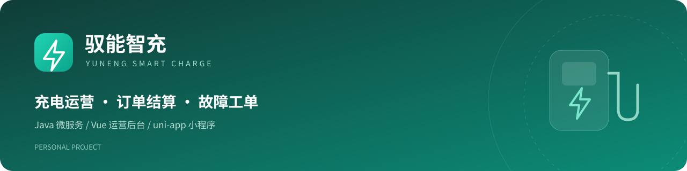

  <h1>驭能智充 · YUNENG ChargeOS</h1>
  <p>从模拟充电、订单结算到积分发放与故障处理，串起完整的运营流程。</p>

  
  
  
  
  
  

  <p>
    <a href="https://ifox-hu.github.io/YUNENG-ChargeOS/">在线演示</a> ·
    <a href="#功能模块">功能模块</a> ·
    <a href="#界面预览">界面预览</a> ·
    <a href="#快速开始">快速开始</a> ·
    <a href="#项目文档">项目文档</a> ·
    <a href="https://github.com/roinli/HUIZHI-ChargeOS-cloud">上游项目</a>
  </p>
</div>

## 项目介绍

**驭能智充**是基于SaaS充电平台骨架二次开发的个人项目，包含 Java 微服务后端、Vue 运营后台与 uni-app 小程序。面向充电运营与运维场景，覆盖站点设备管理、模拟充电、订单查询、账户积分，以及从故障上报到确认关闭的处理流程。

二次开发重点放在 **订单并发与事务边界、Outbox + RocketMQ 可靠发奖、异步告警与工单闭环、运营商配置与租户隔离**。仓库同时提供源码、静态演示和本地验证文档，便于查看界面、理解设计和复现功能。

> 项目定位：个人学习与工程实践展示，非官方发行版。当前充电链路使用模拟设备；真实支付、短信、厂商协议和微信真机发布需单独接入与验收。

## 在线演示

| 体验方式 | 入口与账号 | 说明 |
| --- | --- | --- |
| **运营后台 · Pages** | [立即体验](https://ifox-hu.github.io/YUNENG-ChargeOS/) · `demo` / `Demo123456!` | 免部署体验；填写页面图片验证码，操作保存在当前浏览器 |
| **运营后台 · 本地后端** | 部署后访问 `http://127.0.0.1:8001` · `admin` / `admin123` | 连接本地 MySQL、Redis、RocketMQ 及业务服务 |
| **小程序 · 本地开发** | `yuneng-mini/` · `demo` / `Demo123456!` | 在 HBuilderX / 微信开发者工具中编译并配置 API 地址 |

**推荐体验路线**：登录 → 运营管理 → 充电接口 / 充电订单 → 故障工单 → 告警事件 → 系统管理 → 租户管理 → 运营商开户。

Pages 可体验查询、部分增改删、模拟充电状态、告警重放与工单处理；顶部提供“重置数据”。其中验证码和登录会话均为浏览器演示，不构成服务端安全验证。Pages 不连接真实后端或 MQ，未接入的操作会给出提示。详见[演示与本地运行说明](docs/development-guide.md#github-pages-演示)。

## 功能模块

| 模块 | 已有能力 | 对应源码 |
| --- | --- | --- |
| **站点与设备** | 站点、充电桩、端口管理；设备状态、心跳与模拟启停 | [运营后台](yuneng-admin/src/views/operator) / [运营服务](yuneng-cloud/hcp-modules/hcp-operator) |
| **订单与结算** | 充电订单、费用查询、终态校验、并发结算保护与完成日志 | [结算服务](yuneng-cloud/hcp-modules/hcp-operator/src/main/java/com/hcp/operator/service/impl/ChargingOrderServiceImpl.java) |
| **账户与积分** | 余额与流水、签到、订单奖励；Outbox 事件、消费幂等、失败补偿与人工重投 | [积分链路说明](docs/points-rocketmq.md) |
| **故障工单** | 用户报修、分配、开始处理、解决、用户确认关闭、时间线与统计 | [工单后台](yuneng-admin/src/views/operator/fault) |
| **设备告警** | 事件持久化、MQ 异步关联、重复事件保护、活动工单合并、授权重放 | [告警模块说明](docs/device-alarm-processing.md) |
| **运营商接入** | 配置化开户、管理员初始化、充电规则、白名单与运营商生命周期校验 | [接入指南](docs/operator-onboarding-guide.md) |
| **小程序服务** | 站点浏览、端口选择、模拟充电、订单、账户与报修进度 | [小程序源码](yuneng-mini) |

### 二次开发重点

- **把远程调用移出持锁事务**：端口行锁与短事务预占订单，提交后调用模拟设备；结算保留订单行锁和终态校验。
- **让积分发放可重试、可核对**：结算事务写入 Outbox，RocketMQ 异步消费；账户锁与业务唯一键保护入账，配合租约、退避重试和回执超时补偿。
- **把报修和告警纳入同一工单闭环**：同设备、同类活动工单唯一约束，状态流转与处理日志保持事务一致，关闭后允许生成新工单。
- **按租户配置运营规则**：复用现有账号、设备和权限模型，增加开户与充电规则配置，校验登录身份、资源归属和租户状态。
- **保留可扩展的校验与设备入口**：充电校验拆分为责任链节点，设备启停通过策略接口分发，当前落地模拟器策略。

## 界面预览

### 运营后台

下图来自本项目 Pages 演示，展示登录与告警事件交互。点击图片可查看原图；[截图来源与范围](docs/screenshots/README.md)中说明了演示数据及版本。

| 品牌登录与图片验证码 | 告警事件、处理状态与关联工单 |
| --- | --- |
| 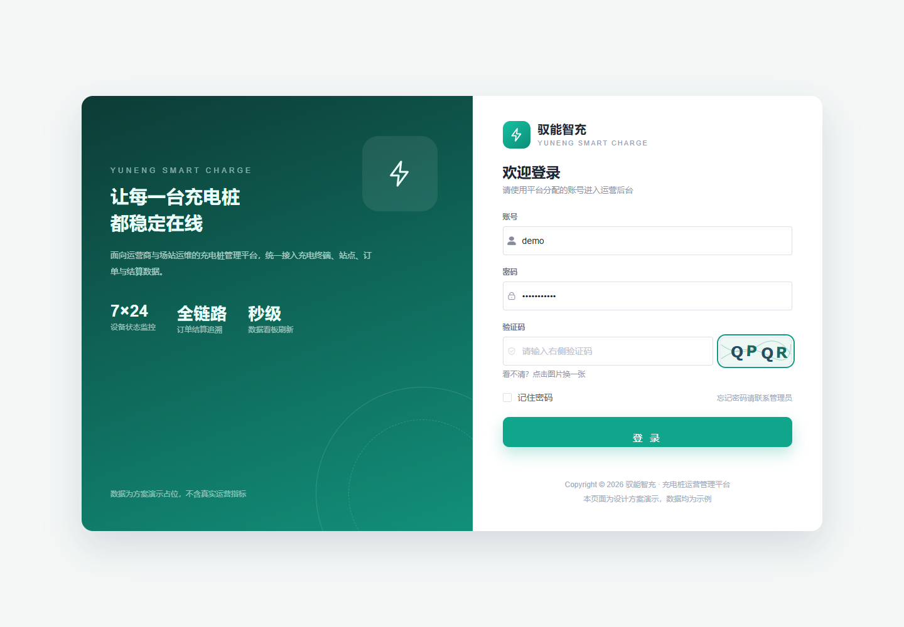 | 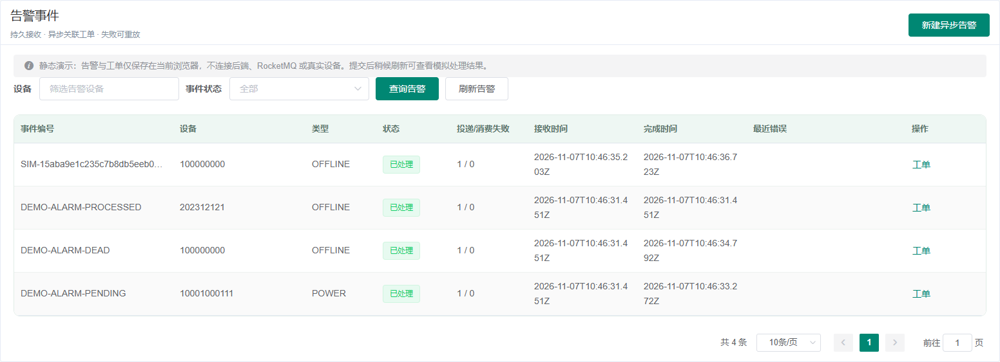 |

### 小程序

以下为已有 **uni-app H5 构建预览**，展示本地接口数据；微信专用组件与 H5 存在显示差异，不作为微信真机验收截图。

#### 首页与站点服务

展示附近站点、快慢充空闲数量、费用信息，以及距离、价格和智能排序入口。

| 首页 · 距离最近 | 首页 · 价格最低 | 首页 · 智能排序 |
| --- | --- | --- |
| 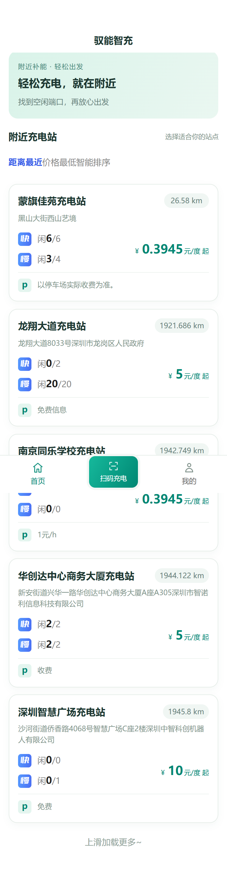 | 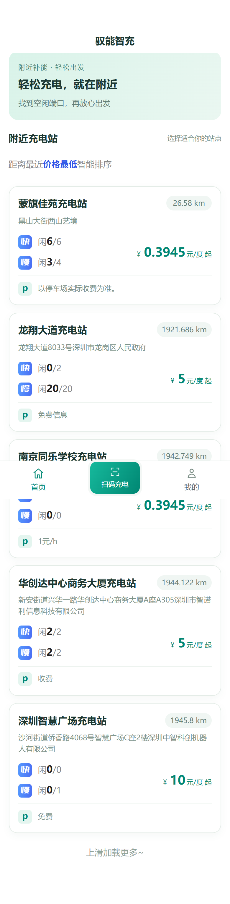 | 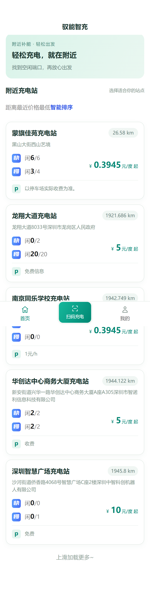 |

#### 设备与充电选择

从站点进入设备列表，查看充电桩与端口状态，再选择端口、充电时长及计费标准。

| 站点设备与空闲状态 | 端口、时长与计费标准 |
| --- | --- |
| 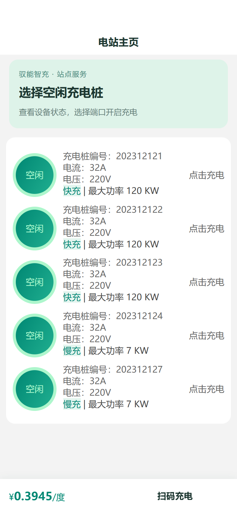 | 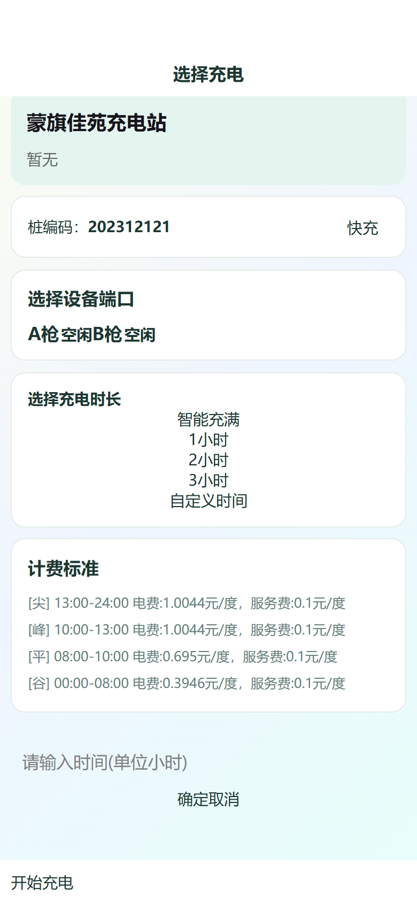 |

#### 订单与费用详情

展示充电订单列表、订单状态、费用明细和状态日志。图中为已有本地测试记录，不代表真实付款凭证。

| 充电订单列表 | 订单详情与状态日志 |
| --- | --- |
| 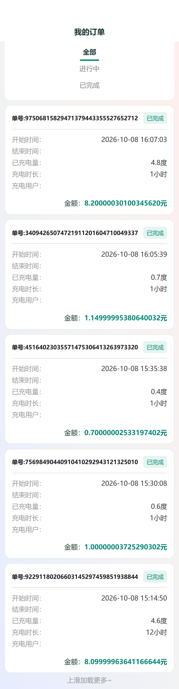 | 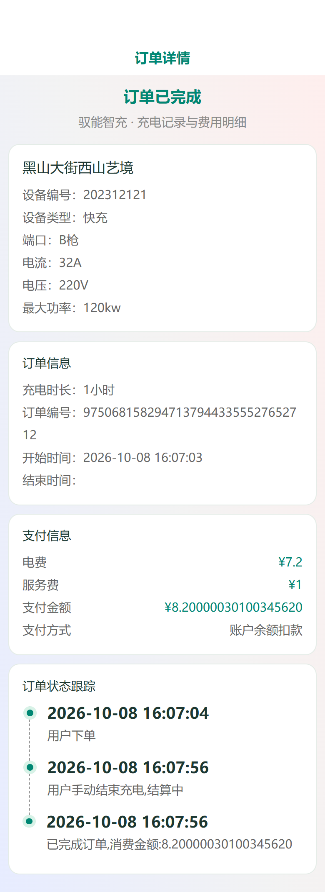 |

#### 个人中心与账户积分

展示个人服务入口、账户余额与流水，以及签到、订单奖励和积分明细。

| 个人中心 | 账户余额与流水 | 积分、签到与订单奖励 |
| --- | --- | --- |
| 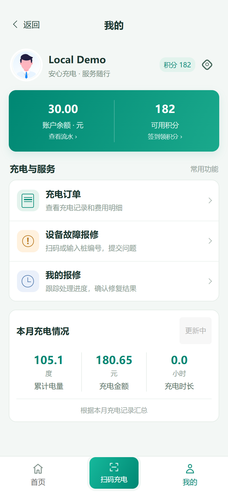 | 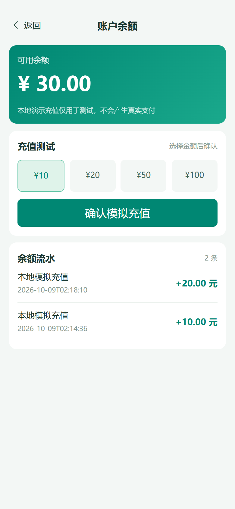 | 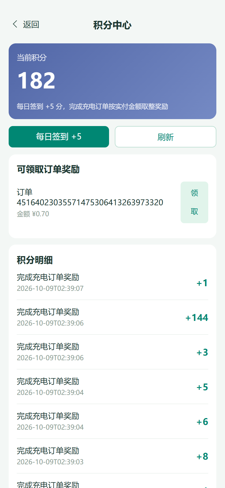 |

#### 登录与故障报修

展示账号登录、填写设备故障，以及查看个人报修记录与处理进度。

| 账号登录 | 创建设备报修 | 我的报修与进度 |
| --- | --- | --- |
| 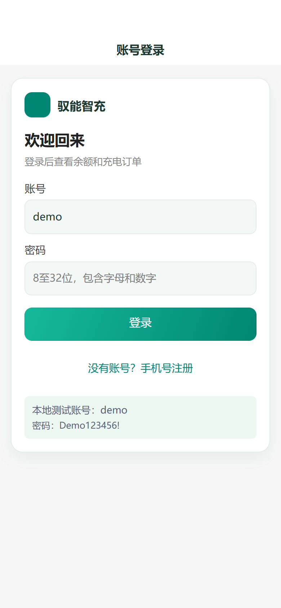 | 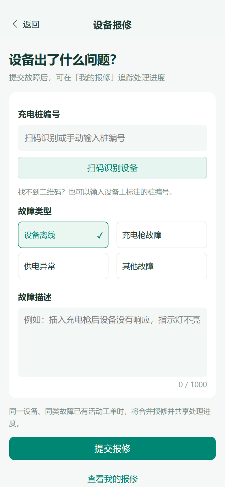 |  |

以上共 13 张功能截图均直接展开。完整界面说明与截图复现步骤见[小程序界面预览](docs/development-guide.md#小程序界面预览)。

## 技术架构

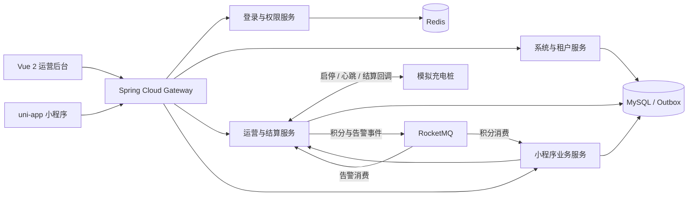
```mermaid
flowchart LR
    Admin[Vue 2 运营后台] --> Gateway[Spring Cloud Gateway]
    Mini[uni-app 小程序] --> Gateway
    Gateway --> Auth[登录与权限服务]
    Gateway --> System[系统与租户服务]
    Gateway --> Operator[运营与结算服务]
    Gateway --> MP[小程序业务服务]
    Operator <-->|启停 / 心跳 / 结算回调| Simulator[模拟充电桩]
    MP --> Operator
    Operator --> DB[(MySQL / Outbox)]
    MP --> DB
    Auth --> Redis[(Redis)]
    System --> DB
    Operator -->|积分与告警事件| MQ[RocketMQ]
    MQ -->|积分消费| MP
    MQ -->|告警消费| Operator
```

| 层次 | 技术 |
| --- | --- |
| 后端 | Java 8、Spring Boot 2.7、Spring Cloud Alibaba、Nacos、MyBatis-Plus、MySQL 8、Redis |
| 消息与设备交互 | RocketMQ 4.9.7、数据库 Outbox、WebSocket、模拟器 |
| 管理后台 | Vue 2、Element UI、Axios、ECharts、Vue CLI |
| 小程序 | uni-app、Vue 3、Vant Weapp、微信开发者工具 |
| 本地部署与演示 | Docker Compose、PowerShell / Bash、GitHub Pages |

## 项目结构

```text
YUNENG-ChargeOS/
├── yuneng-cloud/               Java 微服务后端
│   ├── hcp-gateway/            统一网关
│   ├── hcp-auth/               登录认证
│   ├── hcp-modules/            运营、系统、小程序及模拟器服务
│   ├── hcp-common/             公共组件
│   ├── hcp-api/                服务间接口
│   └── docker/                 Docker 编排与部署脚本
├── yuneng-admin/               Vue 2 运营管理后台
├── yuneng-mini/                uni-app 小程序
├── site/                       可直接发布的 Pages 静态产物
├── scripts/                    构建、回归与演示检查脚本
└── docs/                       使用指南、截图与验证记录
```

## 快速开始

### 1. 获取源码

```bash
git clone https://github.com/ifox-hu/YUNENG-ChargeOS.git
cd YUNENG-ChargeOS
```

### 2. 启动本地后端

首次部署先按[完整开发与部署文档](docs/development-guide.md#环境要求)准备 Docker、JDK、Maven 与项目构建产物。已完成本地初始化和构建后，可在仓库根目录执行：

```powershell
powershell -ExecutionPolicy Bypass -File .\yuneng-cloud\docker\start-local.ps1 -AllModules
```

部署后的 Nginx 后台端口为 `8001`，API 网关端口为 `38080`。Linux 部署、数据库增量脚本、构建及排错说明见[部署文档](docs/development-guide.md#快速启动)。

### 3. 启动连接后端的前端

```powershell
Set-Location .\yuneng-admin
npm ci
$env:VUE_APP_DEMO = 'false'
npm run dev -- --host 127.0.0.1 --port 8080
```

浏览器访问 `http://127.0.0.1:8080/login`。开发代理将 `/dev-api` 转发至 `http://127.0.0.1:38080`；使用本地后台账号并填写服务端图片验证码。

### 4. 构建静态演示

后台依赖安装后，回到仓库根目录执行：

```powershell
powershell -ExecutionPolicy Bypass -File .\scripts\build-pages.ps1
```

将更新后的 `site/` 产物一起提交到 `master` 或 `main`，已有 [Pages 工作流](.github/workflows/pages.yml)会发布演示站。小程序编译、接口和回归脚本详见完整开发文档。

## 项目文档

| 文档 | 内容 |
| --- | --- |
| [开发、部署与验证完整说明](docs/development-guide.md) | Windows / Linux 环境、后端与前端构建、小程序配置、接口、演示与回归命令 |
| [配置化运营商接入](docs/operator-onboarding-guide.md) | 开户、规则、白名单、生命周期与租户边界 |
| [运营商接入验证报告](docs/operator-onboarding-test-report-2026-11-07.md) | 功能、权限、事务与本地测试口径 |
| [设备告警设计](docs/device-alarm-processing.md) | 持久化接收、异步处理、工单关联、补偿与授权重放 |
| [设备告警验证报告](docs/device-alarm-test-report-2026-11-04.md) | 本地回归、有限批次压测与逐事件对账 |
| [积分消息链路](docs/points-rocketmq.md) | RocketMQ 部署、Outbox、幂等消费、迁移与异常恢复 |
| [停止充电并发修复](docs/charging-stop-concurrency-fix-2026-11-02.md) | 事务连接占用问题、降级修复及模拟充电回归 |
| [Pages 图形验证码](docs/pages-captcha-2026-11-07.md) | 静态验证码交互、验证范围与服务端校验边界 |

测试报告均按对应日期的本地环境记录。模拟设备与短批次测量不代表真实设备连接规模、生产吞吐或线上可用性承诺。

## 来源与说明

本项目基于 [慧知开源充电平台](https://github.com/roinli/HUIZHI-ChargeOS-cloud)二次开发，管理后台与小程序分别来自其对应模块。感谢上游作者及相关开源项目。

仓库首页参考上游的信息组织方式，品牌图和界面截图来自本项目。上游模块保留原有版权与许可证文件，具体条款以对应源码中的许可文件及上游说明为准；本项目未声明为慧知官方版本或商业发行版。

请勿提交数据库数据盘、运行日志、私钥或生产凭据。本地账号、模拟充值和模拟充电配置仅用于开发与演示；正式支付、硬件协议及公网部署需独立配置与验收。

<div align="center">
  <p><a href="#项目介绍">返回顶部 ↑</a></p>
</div>
